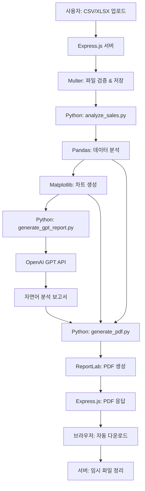

# 프로젝트 요약 (Project Summary)

## 📊 Sales Report Generator

**자동 매출 리포트 생성 웹 애플리케이션**

Pandas와 GPT API를 활용하여 CSV/XLSX 파일에서 전문적인 PDF 보고서를 자동으로 생성하는 풀스택 웹 애플리케이션입니다.

---

## 🎯 프로젝트 목표

사용자가 판매 데이터 파일을 업로드하면:
1. ✅ **Pandas**로 주요 통계를 자동 계산
2. ✅ **Matplotlib**로 데이터 시각화 차트 생성
3. ✅ **GPT API**로 자연어 분석 보고서 작성
4. ✅ **ReportLab**으로 전문적인 PDF 생성
5. ✅ **Express.js**로 즉시 다운로드 제공

---

## 📁 프로젝트 구조

```
vibe-1122-acorn-ml-prediction/
│
├── 📄 Backend & API
│   ├── server.js                      # Express.js 서버
│   ├── analyze_sales.py               # Pandas 데이터 분석
│   ├── generate_gpt_report.py         # GPT API 통합
│   ├── generate_pdf.py                # ReportLab PDF 생성
│   └── test_analysis.py               # 분석 테스트 스크립트
│
├── 🎨 Frontend
│   └── public/
│       ├── index.html                 # 메인 웹페이지
│       ├── styles.css                 # 스타일시트
│       └── app.js                     # 클라이언트 JavaScript
│
├── 📋 Configuration
│   ├── package.json                   # Node.js 의존성
│   ├── requirements.txt               # Python 의존성
│   ├── .env.example                   # 환경 변수 템플릿
│   └── .gitignore                     # Git 제외 파일
│
├── 📚 Documentation
│   ├── README.md                      # 프로젝트 소개
│   ├── SETUP_GUIDE.md                 # 설치 가이드
│   ├── USAGE_GUIDE.md                 # 사용 가이드
│   ├── FEATURES.md                    # 기능 상세 설명
│   └── PROJECT_SUMMARY.md             # 이 파일
│
├── 🔧 Scripts
│   └── start.sh                       # 자동 시작 스크립트
│
├── 📊 Sample Data
│   ├── Sample-100-Superstore.csv      # 예시 데이터
│   └── data-analysis-for-marketing-strategy.ipynb
│
└── 📂 Runtime Directories (자동 생성)
    ├── uploads/                       # 업로드 파일 임시 저장
    ├── output/                        # 생성된 PDF 저장
    └── temp_charts/                   # 차트 이미지 임시 저장
```

---

## 🛠️ 기술 스택

### Backend
| 기술 | 용도 | 버전 |
|------|------|------|
| **Node.js** | JavaScript 런타임 | 14+ |
| **Express.js** | 웹 서버 프레임워크 | 4.18.2 |
| **Python** | 데이터 분석 | 3.8+ |
| **Multer** | 파일 업로드 처리 | 1.4.5 |
| **dotenv** | 환경 변수 관리 | 16.3.1 |

### Data Analysis & Visualization
| 기술 | 용도 | 버전 |
|------|------|------|
| **Pandas** | 데이터 분석 | 2.1.4 |
| **NumPy** | 수치 계산 | 1.26.2 |
| **Matplotlib** | 데이터 시각화 | 3.8.2 |
| **Seaborn** | 통계 시각화 | 0.13.0 |

### AI & Document Generation
| 기술 | 용도 | 버전 |
|------|------|------|
| **OpenAI API** | GPT-4o 자연어 생성 | 1.6.1 |
| **ReportLab** | PDF 생성 | 4.0.7 |
| **Pillow** | 이미지 처리 | 10.1.0 |

### Frontend
| 기술 | 용도 |
|------|------|
| **HTML5** | 구조 |
| **CSS3** | 스타일링 (Flexbox, Grid) |
| **JavaScript** | 클라이언트 로직 |

---

## 🔄 데이터 처리 플로우



---

## 📊 생성되는 분석 내용

### 1. 통계 분석
- 📈 총 매출, 이익, 이익률
- 📊 평균, 중간값, 최대/최소값
- 🔢 총 주문 수, 판매 수량

### 2. 카테고리 분석
- 📦 카테고리별 매출 및 이익
- 🏆 상위 10개 서브카테고리
- 💰 카테고리별 평균 매출

### 3. 지역 분석
- 🌍 상위 10개 지역 성과
- 📍 지역별 수익성 비교
- ⚠️ 손실 지역 식별

### 4. 고객 세그먼트 분석
- 👥 세그먼트별 매출 및 이익
- 💼 기업/소비자/가정용 비교
- 🎯 타겟 고객군 식별

### 5. 시계열 분석
- 📅 월별 매출 추세
- 📈 성장률 계산
- 🔮 계절성 패턴

### 6. 데이터 시각화 (6개 차트)
1. **카테고리별 매출** - 가로 막대 차트
2. **지역별 이익** - 색상 구분 막대 차트
3. **서브카테고리 매출** - 세로 막대 차트
4. **세그먼트 비교** - 그룹 막대 차트
5. **매출-이익 상관관계** - 산점도
6. **월별 추세** - 선 그래프

### 7. AI 생성 보고서 (GPT-4o)
- 📝 전체 개요 (Executive Summary)
- 🔍 주요 발견 사항 (Key Findings)
- 📊 카테고리/지역/세그먼트 상세 분석
- 💡 개선 제안 및 마케팅 전략
- 🎯 결론 및 다음 단계

---

## 🚀 빠른 시작

### 1단계: 의존성 설치
```bash
# Node.js 패키지
npm install

# Python 패키지
pip3 install -r requirements.txt
```

### 2단계: 환경 설정
```bash
# .env 파일 생성
echo "OPENAI_API_KEY=your_api_key_here" > .env
echo "PORT=3000" >> .env
```

### 3단계: 서버 시작
```bash
# 방법 1: 자동 스크립트
./start.sh

# 방법 2: npm 명령
npm start
```

### 4단계: 브라우저 접속
```
http://localhost:3000
```

---

## 💡 주요 기능

### 1️⃣ 직관적인 파일 업로드
- 드래그 앤 드롭
- 파일 선택 버튼
- 실시간 파일 검증
- 파일 정보 미리보기

### 2️⃣ 실시간 진행 상황
- 시각적 진행바 (0-100%)
- 단계별 상태 메시지
- 부드러운 애니메이션

### 3️⃣ 자동 데이터 분석
- Pandas로 통계 자동 계산
- groupby(), describe() 등 활용
- 다양한 집계 함수 적용

### 4️⃣ AI 기반 인사이트
- GPT-4o 자연어 처리
- 비즈니스 인사이트 제공
- 마케팅 전략 제안

### 5️⃣ 전문적인 차트
- 6가지 시각화
- 고해상도 (300 DPI)
- 색상 코딩 (수익성)

### 6️⃣ PDF 자동 생성
- ReportLab 활용
- 전문적인 레이아웃
- 테이블, 차트, 텍스트 통합

### 7️⃣ 즉시 다운로드
- 브라우저 자동 다운로드
- 고유한 파일명 생성
- 임시 파일 자동 정리

---

## 📈 사용 예시

### 입력 데이터 (CSV/XLSX)
```csv
Sales,Profit,Category,State,Order Date,Quantity
261.96,41.91,Furniture,Kentucky,11/8/2016,2
731.94,219.58,Furniture,Kentucky,11/8/2016,3
14.62,6.87,Office Supplies,California,6/12/2016,2
...
```

### 출력 PDF 내용
1. **표지 페이지**
   - 제목: Sales Analysis Report
   - 생성 날짜

2. **Executive Summary 테이블**
   ```
   Total Sales:        $45,000.00
   Total Profit:       $8,500.00
   Profit Margin:      18.89%
   Total Orders:       100
   Average Sales:      $450.00
   ```

3. **Category Performance 테이블**
   ```
   Category    | Total Sales | Total Profit | Orders | Avg Sales
   ------------|-------------|--------------|--------|----------
   Furniture   | $20,000.00  | $3,000.00   | 40     | $500.00
   Technology  | $15,000.00  | $4,000.00   | 30     | $500.00
   Office      | $10,000.00  | $1,500.00   | 30     | $333.33
   ```

4. **6개 시각화 차트**
   - 고해상도 이미지
   - 명확한 제목과 레이블

5. **AI 분석 보고서 (2-3 페이지)**
   - 자연어로 작성된 전문 분석
   - 데이터 기반 인사이트
   - 실행 가능한 제안

---

## 🎨 디자인 하이라이트

### 색상 테마
- **주 색상**: 보라색 그라디언트 (#667eea → #764ba2)
- **성공**: 녹색 (#4caf50)
- **경고**: 노란색 (#ffd54f)
- **오류**: 빨간색 (#c62828)

### UI/UX 특징
- ✨ 부드러운 애니메이션
- 🎨 모던한 그라디언트
- 📱 완전한 반응형 디자인
- 🖱️ 직관적인 인터랙션
- ♿ 접근성 고려

---

## 🔒 보안 및 검증

### 파일 업로드 보안
- ✅ 파일 형식 검증 (.csv, .xlsx, .xls만)
- ✅ 파일 크기 제한 (10MB)
- ✅ 파일 이름 sanitization
- ✅ 임시 저장 후 자동 삭제

### 데이터 처리
- ✅ 에러 핸들링
- ✅ 입력 검증
- ✅ SQL 인젝션 방지 (Pandas)
- ✅ 메모리 관리

### API 보안
- ✅ 환경 변수로 API 키 관리
- ✅ .gitignore에 .env 추가
- ✅ CORS 설정
- ✅ 에러 메시지 적절히 처리

---

## 📊 성능 지표

### 처리 시간
- **소규모** (< 1,000 행): ~10-15초
- **중규모** (1,000-10,000 행): ~15-25초
- **대규모** (10,000+ 행): ~25-40초

### 리소스 사용
- **메모리**: ~100-500MB (데이터 크기에 따라)
- **CPU**: 분석 중 높음, 대기 시 낮음
- **디스크**: 임시 파일 < 50MB

### 확장성
- **동시 사용자**: 10-50명 (단일 서버)
- **PM2로 확장**: CPU 코어 수만큼
- **로드 밸런싱**: 필요 시 추가 가능

---

## 🧪 테스트

### 분석 기능 테스트
```bash
python3 test_analysis.py
```

### 서버 상태 확인
```bash
curl http://localhost:3000/api/health
```

### API 직접 테스트
```bash
curl -X POST http://localhost:3000/api/generate-report \
  -F "file=@Sample-100-Superstore.csv" \
  --output test-report.pdf
```

---

## 📝 라이선스 및 크레딧

### 사용된 오픈소스
- **Express.js**: MIT License
- **Pandas**: BSD License
- **Matplotlib**: PSF License
- **ReportLab**: BSD License
- **OpenAI API**: Commercial License

### 참고 자료
- ReportLab Documentation: https://docs.reportlab.com/
- Pandas Documentation: https://pandas.pydata.org/
- OpenAI API Documentation: https://platform.openai.com/docs/

---

## 🚀 향후 개선 사항

### 단기 목표
- [ ] 다중 파일 동시 처리
- [ ] 차트 커스터마이징 옵션
- [ ] 이메일 자동 발송
- [ ] 보고서 템플릿 선택

### 중기 목표
- [ ] 데이터베이스 통합
- [ ] 사용자 인증 시스템
- [ ] 보고서 이력 관리
- [ ] 예측 분석 추가

### 장기 목표
- [ ] 실시간 대시보드
- [ ] 협업 기능
- [ ] 모바일 앱
- [ ] 클라우드 배포

---

## 💬 지원 및 문의

### 문서
- 📖 [README.md](./README.md) - 프로젝트 소개
- 🔧 [SETUP_GUIDE.md](./SETUP_GUIDE.md) - 설치 가이드
- 📘 [USAGE_GUIDE.md](./USAGE_GUIDE.md) - 사용 방법
- 🎯 [FEATURES.md](./FEATURES.md) - 기능 상세

### 문제 해결
1. 문서 확인
2. 서버 로그 검토
3. 테스트 스크립트 실행
4. GitHub Issues 생성

---

## 🎉 시작하기

**지금 바로 시작하세요!**

```bash
# 1. 자동 설치 및 시작
./start.sh

# 2. 브라우저 열기
# http://localhost:3000

# 3. Sample-100-Superstore.csv 업로드

# 4. 리포트 생성 버튼 클릭

# 5. PDF 다운로드 완료! 🎊
```

**Happy Analyzing! 📊✨**

---

*이 프로젝트는 Pandas, GPT API, ReportLab을 활용하여 전문적인 비즈니스 인텔리전스 도구를 만드는 방법을 보여줍니다.*

*Created with ❤️ using Python, Node.js, and AI*

